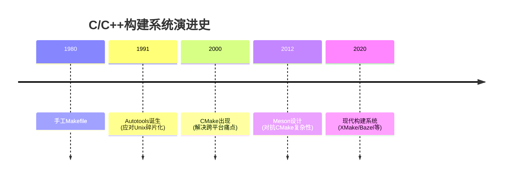

# C/C++ 构建工具

### 一、C/C++构建系统的"进化树"


关键转折点：
- **Autotools时代**：解决"如何在Solaris/AIX/HP-UX等不同Unix上构建"的问题
- **CMake崛起**：应对Windows/Linux/macOS多平台开发需求
- **Meson革新**：针对CMake语法晦涩、速度慢的改良

---

### **构建工具诞生和区别**
| 工具       | 诞生时间 | 核心目标                          | 典型用户               |
|------------|----------|-----------------------------------|------------------------|
| **make**   | 1976     | 增量编译，依赖追踪                | Linux 内核、传统 Unix  |
| **Autotools** | 1991  | 跨 Unix 平台配置                  | GCC、GTK              |
| **CMake**  | 2000     | 跨平台生成构建文件                | LLVM、KDE             |
| **Bazel**  | 2015     | 超大规模可复现构建                | Google、TensorFlow    |
| **Meson**  | 2013     | 替代 CMake，强调简洁              | GNOME、Systemd        |
| **Ninja**  | 2011     | 极速构建（配合 CMake/Meson）      | Chrome、Android       |

现代 C/C++ 项目通常选择 **CMake + Ninja** 或 **Bazel**，传统 Unix 项目仍依赖 **make/Autotools**。

### **演进趋势**
1. **从平台特定到跨平台**：  
   `make` → `Autotools` → `CMake`/`Meson`。
2. **从脚本化到声明式**：  
   `Makefile` → `CMakeLists.txt` → `BUILD`（Bazel）。
3. **性能优化**：  
   `make` → `Ninja`（极简执行），`Bazel`（分布式缓存）。
4. **语言现代化**：  
   从 `make` 的 Shell 语法到 `CMake`/`Meson` 的类 Python 语法。

---

## 构建工具大致分类

### **1. "Makefile 派系"（依赖 make 或类似逻辑）**
这些工具最终生成的构建规则需要由 `make` 或类似工具（如 `ninja`）执行，但设计哲学和底层机制差异较大：

| 工具          | 生成文件         | 后端执行工具 | 核心特点                              | 与 `make` 的关系               |
|---------------|------------------|--------------|---------------------------------------|--------------------------------|
| **make**      | 直接编写 Makefile | make         | 原生规则，手动编写依赖                | 本体                           |
| **Autotools** | 生成 Makefile     | make         | 通过 `configure` 适配多平台           | 生成标准化 Makefile             |
| **CMake**     | 生成 Makefile/Ninja | make/ninja   | 跨平台生成，模块化设计                | 可脱离 make（如用 Ninja 或 VS）|
| **Bazel**     | 生成内部规则      | 自有引擎     | 分布式构建，严格依赖管理              | 完全独立，不依赖 make          |

- **关键区别**：  
  - `make` 和 `Autotools` 强绑定 `make` 命令，而 `CMake` 是**生成器**，可自由选择后端（如 `make` 或 `ninja`）。  
  - `Bazel` 是**独立引擎**，虽然设计思想受 `make` 启发，但实现完全脱离传统 Makefile（如使用沙盒隔离、远程缓存）。

### **2. "Ninja 派系"（依赖 ninja 作为后端）**
这些工具将 `ninja` 作为底层执行引擎，但抽象了规则生成：

| 工具       | 生成文件      | 后端执行工具 | 核心特点                      | 与 `make` 的关系               |
|------------|---------------|--------------|-------------------------------|--------------------------------|
| **Meson**  | build.ninja   | ninja        | 简洁语法，强调速度            | 完全替代 make，语法更现代化    |
| **GN**     | 生成 ninja    | ninja        | Chromium 专用，高性能         | 类似 Bazel 但更轻量            |

- **Ninja 的角色**：  
  - 专为**快速执行构建**设计，不处理依赖分析（由上层工具如 Meson 完成）。  
  - 相比 `make`，`ninja` 的语法极简（类似汇编），仅做任务调度。

### **3. 其他独立派系**
完全脱离传统 Makefile 和 Ninja 的工具：

| 工具        | 构建引擎       | 特点                              | 典型场景              |
|-------------|----------------|-----------------------------------|-----------------------|
| **Bazel**   | 自有引擎       | 分布式构建，强一致性              | 超大规模项目（Google）|
| **XMake**   | 自有引擎       | 内置依赖管理，Lua 脚本            | 跨平台嵌入式开发      |
| **SCons**   | Python 解释器  | 脚本化构建，灵活性高              | 小众项目              |

### **核心结论**
1. **Makefile 派系**：  
   - `make` 和 `Autotools` 是传统派，直接依赖 `make` 命令。  
   - `CMake` 是**跨平台生成器**，可自由选择后端（`make` 或 `ninja`），属于“现代 Makefile 生态”。  

2. **Ninja 派系**：  
   - `Meson` 等工具将 `ninja` 作为底层引擎，但语法和依赖分析与 `make` 无关。  
   - `ninja` 本身是 `make` 的替代执行器，而非规则生成器。  

3. **独立派系**：  
   - `Bazel`、`XMake` 等完全脱离传统工具链，自有规则管理和执行引擎。  

### **为什么 Meson 不属于 "Makefile 派系"？**
- **设计哲学**：  
  Meson 的 `meson.build` 语法（类似 Python）和依赖分析与 `Makefile` 的基于时间戳的规则完全不同。  
- **后端依赖**：  
  虽然 `CMake` 也能生成 `ninja` 规则，但 `Meson` 默认仅支持 `ninja`，且不提供 `Makefile` 兼容性。  

### **现代项目的选择趋势**
- **传统/嵌入式**：`make` 或 `CMake + Makefile`  
- **跨平台新项目**：`CMake + Ninja` 或 `Meson`  
- **超大规模**：`Bazel`  
- **极简需求**：`Ninja`（手动编写 `build.ninja`，但罕见）  

 `CMake` 的灵活性（它既是“Makefile 派系”的进化，又可脱离 make 使用 Ninja）。

---
以下是 **C/C++ 构建工具的发展和演变历程**，按时间顺序列举主流工具及其诞生的背景和解决的问题：

### **1. make (1976)**
- **诞生时间**：1976 年（Stuart Feldman，贝尔实验室）  
- **背景与问题**：  
  - 早期 Unix 项目规模扩大，手动编译多个源文件效率低下。  
  - 需要一种工具能自动追踪文件依赖关系，仅重新编译修改过的文件。  
- **解决方案**：  
  - 通过 `Makefile` 定义目标、依赖和命令，实现增量编译。  
- **影响**：  
  - 成为 Unix/Linux 生态的基础工具，至今仍广泛使用（如 Linux 内核编译）。


### **2. Autotools (GNU Build System, 1990s)**
- **诞生时间**：1990 年代初（GNU 项目）  
- **主要组件**：`autoconf` (1991)、`automake` (1994)、`libtool`  
- **背景与问题**：  
  - 不同 Unix 系统存在差异（如库路径、编译器特性），需要跨平台配置。  
  - `Makefile` 手写复杂，难以适应多平台。  
- **解决方案**：  
  - `autoconf`：生成 `configure` 脚本，检测系统环境。  
  - `automake`：基于高级规则生成标准化的 `Makefile.in`。  
- **影响**：  
  - 成为开源项目（如 GCC、GTK）的标准构建流程，但配置复杂。


### **3. SCons (2000)**
- **诞生时间**：2000 年  
- **背景与问题**：  
  - `make` 的语法受限，依赖处理不够灵活。  
  - 需要更现代化的脚本化构建工具。  
- **解决方案**：  
  - 用 **Python 脚本**定义构建规则，支持跨平台依赖分析。  
- **特点**：  
  - 无需 `Makefile`，但性能较差，未成为主流。


### **4. CMake (2000)**
- **诞生时间**：2000 年（Kitware 公司）  
- **背景与问题**：  
  - `Autotools` 仅适用于 Unix，Windows 开发者需要替代方案（如 Visual Studio）。  
  - 需要一种跨平台、能生成多种构建系统（如 Makefile、VS 项目）的工具。  
- **解决方案**：  
  - 使用 `CMakeLists.txt` 定义构建规则，生成原生构建文件（如 `Makefile` 或 `.sln`）。  
- **影响**：  
  - 成为现代 C/C++ 项目的标准（如 KDE、LLVM），支持复杂依赖管理和模块化。


### **5. Waf (2005)**
- **诞生时间**：2005 年  
- **背景与问题**：  
  - `Autotools` 和 `SCons` 性能不足，配置复杂。  
- **解决方案**：  
  - 基于 Python 的单脚本构建工具，强调速度和易用性。  
- **应用**：  
  - 用于部分开源项目（如 Bitcoin），但未广泛普及。

### **6. Bazel (2015)**
- **诞生时间**：2015 年（Google 开源）  
- **背景与问题**：  
  - 超大规模代码库（如 Google 内部）需要高效、可复现的构建。  
  - `make` 和 `CMake` 在分布式构建和缓存方面不足。  
- **解决方案**：  
  - 基于声明式规则（`BUILD` 文件），支持增量编译、远程缓存和分布式构建。  
- **影响**：  
  - 成为大数据/AI 领域的主流（如 TensorFlow），但对小型项目过重。

### **7. Meson (2013)**
- **诞生时间**：2013 年  
- **背景与问题**：  
  - `CMake` 语法晦涩，配置复杂，缺乏现代语言特性。  
- **解决方案**：  
  - 使用简洁的 `meson.build` 脚本（类似 Python），强调速度和易读性。  
  - 依赖 `Ninja` 作为后端构建工具。  
- **应用**：  
  - 被 GNOME、Systemd 等项目采用。

### **8. Ninja (2011)**
- **诞生时间**：2011 年（Google 开发）  
- **背景与问题**：  
  - `make` 在超大型项目（如 Chrome）中构建速度慢。  
- **解决方案**：  
  - 极简的构建工具，专注于执行速度（不处理依赖分析，由 CMake/Meson 生成规则）。  
- **定位**：  
  - 作为底层引擎，被 CMake、Meson 等调用。

### **9. XMake (2015)**
- **诞生时间**：2015 年（中国开发者）  
- **背景与问题**：  
  - 希望提供更简单的跨平台构建工具（类似 CMake，但更轻量）。  
- **解决方案**：  
  - 使用 `xmake.lua` 配置，内置依赖管理，支持多工具链。  

---

### Eclipse CDT 分析

#### Eclipse CDT的典型痛点
1. **CMake项目**：
   - 项目配置分散在`CMakeLists.txt`和`.project`文件中
   - 无法可视化修改`target_link_libraries`等关键指令
   - 调试配置需手动同步`launch.json`

2. **Makefile项目**：
   - 完全无依赖分析（无法显示`#include`关系图）
   - 代码补全基于文件扫描而非真实构建规则

3. **Meson项目**：
   - 需要手动运行`meson setup builddir`生成编译数据库
   - 重构操作（如重命名函数）可能破坏`meson.build`文件

---

### 三、设计原则与解决方案

#### 1. 抽象层级设计（关键创新点）
```plaintext
           ┌──────────────────────┐
           │  统一工程模型(Project) │ ← 用户可见层
           └──────────┬───────────┘
     ┌───────────────┴────────────────┐
     │ 构建系统适配层(Build Adapter)   │ ← 核心创新点
     ├───────┬───────┬────────────────┤
     │CMake  │Meson  │Makefile        │ ← 具体实现
     └───────┴───────┴────────────────┘
```

**实现示例**：
```java
interface BuildSystemAdapter {
    void syncWithIDE(Project project);  // 同步构建系统与IDE配置
    File generateBuildScripts();        // 生成构建文件
    List<IncludePath> getIncludePaths(); // 获取解析后的头文件路径
}
```

#### 2. 必须解决的三大核心问题

**问题1：构建系统差异屏蔽**
- 解决方案：设计统一属性模型
```xml
<!-- 示例：统一的可视化配置 -->
<buildConfiguration>
    <outputType>EXECUTABLE</outputType> <!-- 可执行/静态库/动态库 -->
    <includePaths> <!-- 自动从各构建系统提取 -->
        <path>/usr/local/include</path>
    </includePaths>
    <defines> <!-- 跨构建系统的宏定义 -->
        <define>DEBUG=1</define>
    </defines>
</buildConfiguration>
```

**问题2：实时同步机制**
- 实现双向同步：
  ```python
  # 监控文件变化的伪代码
  def on_file_changed(file):
      if file == "CMakeLists.txt":
          update_ide_config()
      elif file == ".project":
          update_build_script()
  ```

**问题3：调试配置生成**
- 动态生成`launch.json`：
  ```jsonc
  {
      "configurations": [{
          "name": "Debug (自动生成)",
          "program": "${buildDir}/myapp",
          "args": [],
          "environment": [
              {"name": "LD_LIBRARY_PATH", "value": "${env:LD_LIBRARY_PATH}:${buildDir}"}
          ]
      }]
  }
  ```

---

### 四、推荐架构实现

#### 分层架构设计
```plaintext
┌──────────────────────────────┐
│         IDE Plugin           │
├──────────────┬───────────────┤
│ 用户界面层     │ 核心引擎层    │
│ - 向导对话框  │ - 项目模型    │
│ - 属性编辑器  │ - 构建适配器  │
│ - 菜单扩展    │ - 同步引擎    │
└──────────────┴───────────────┘
```

#### 关键技术点
1. **构建系统探测**：
   ```java
   // 自动检测项目类型
   BuildSystem detectBuildSystem(Project project) {
       if (findFile("CMakeLists.txt")) return CMAKE;
       if (findFile("meson.build")) return MESON;
       if (findFile("Makefile")) return MAKEFILE;
   }
   ```

2. **增量式项目加载**：
   - 首次加载：快速扫描关键文件建立基础索引
   - 后台线程：完整解析构建系统生成精确配置

3. **错误恢复机制**：
   ```python
   try:
       generate_build_files()
   except BuildError as e:
       show_quick_fix([
           "更新CMake版本",
           "清理构建目录",
           "手动编辑配置"
       ])
   ```

---

### 五、演进路线建议

1. **MVP版本功能优先级**：
   - 第一阶段：实现CMake的完整支持（覆盖80%用户）
   - 第二阶段：添加Meson适配器（解决性能敏感用户需求）
   - 第三阶段：Makefile智能辅助（兼容遗留项目）

2. **差异化竞争点**：
   - **一键迁移**：支持从其他IDE（如VS/Qt Creator）导入项目
   - **混合构建**：允许单个项目同时使用CMake+Makefile
   - **云构建集成**：自动生成GitHub Actions/.gitlab-ci.yml

---

### 六、开发者体验优化示例

**场景**：用户添加新源文件
```typescript
// 理想中的交互流程
ide.onFileCreated('src/new_file.c', () => {
    const buildSystem = currentProject.buildSystem;
    
    if (buildSystem.isManaged) { // CMake/Meson项目
        showQuickPick([
            "添加到现有目标",
            "创建新目标",
            "仅添加文件"
        ]);
    } else { // Makefile项目
        showDiffEditor(
            "建议修改Makefile",
            generateMakefilePatch()
        );
    }
});
```

这种设计既尊重了不同构建系统的哲学差异，又提供了统一的用户体验，这才是解决"不好用"问题的根本之道。建议从CMake适配器开始实现，逐步扩展到其他构建系统。


