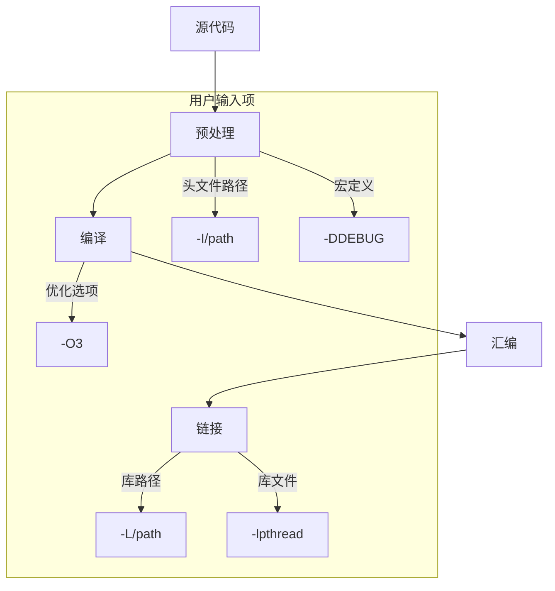

# C/C++工程构建过程详解

C/C++工程整个构建过程的各个阶段及其相关概念。

## 构建(Build)的基本概念

构建是指将源代码转换为可执行文件或库的过程。在IDE中点击"Build"按钮时，背后实际上发生了一系列复杂的步骤。

## 构建的主要阶段

### 1. 预处理(Preprocessing)

**作用**：处理源代码中的预处理指令
**输入**：
- 源代码文件(.c/.cpp/.h/.hpp)
- 编译器定义的宏
- 包含路径(-I参数指定的目录)
- 预定义的宏(-D参数)

**输出**：经过处理的源代码(可通过`gcc -E`查看)

**关键操作**：
- 展开宏定义
- 处理条件编译(#ifdef等)
- 包含头文件(#include) 头文件通常包含：函数声明、类定义、宏定义、类型定义等
- 删除注释

### 2. 编译(Compilation)

**作用**：将预处理后的源代码转换为汇编代码
**输入**：
- 预处理后的源代码
- 编译器选项(优化级别、语言标准等)

**输出**：汇编代码文件(.s)或直接到目标文件(.o)

**关键操作**：
- 语法和语义分析
- 生成中间表示
- 代码优化
- 生成目标平台的汇编代码

### 3. 汇编(Assembly)

**作用**：将汇编代码转换为机器码(目标文件)
**输入**：汇编代码文件

**输出**：目标文件(.o或.obj)

**关键操作**：
- 将汇编指令转换为机器指令
- 生成可重定位的目标文件

### 4. 链接(Linking)

**作用**：将多个目标文件和库合并为最终可执行文件
**输入**：
- 目标文件(.o)
- 静态库(.a或.lib)
- 动态库(.so或.dll)
- 链接器脚本
- 系统库路径

**输出**：可执行文件或共享库

**关键操作**：
- 符号解析(解决外部引用)
- 重定位(调整地址)
- 库的链接
- 生成可执行文件格式(ELF、PE等)

## 构建过程中的关键外部因素

### 1. 工具链(Toolchain)

- **编译器**：gcc/g++, clang, MSVC等
- **链接器**：ld, link.exe等
- **构建工具**：make, cmake, ninja等
- **调试工具**：gdb, lldb等

### 2. 系统根目录(Sysroot)

**定义**：Sysroot是构建系统时使用的根目录，包含目标系统的头文件和库。

**作用**：
- 提供目标系统的标准头文件
- 提供目标系统的库文件
- 确保构建产物能在目标系统运行

**使用场景**：
- 交叉编译时(为不同架构或系统构建)
- 嵌入式开发
- 指定特定版本的库

### 3. 构建系统(Build System)

大型工程通常使用构建系统管理复杂构建过程：

- **Makefile**：定义构建规则和依赖关系
- **CMake**：跨平台的构建系统生成器
- **Autotools**：GNU的构建系统
- **Bazel**：Google的开源构建工具

### 4. 环境变量

影响构建过程的重要环境变量：
- PATH：查找工具链的可执行文件
- LD_LIBRARY_PATH(或DYLD_LIBRARY_PATH)：运行时库搜索路径
- C_INCLUDE_PATH/CPLUS_INCLUDE_PATH：头文件搜索路径
- LIBRARY_PATH：链接时库搜索路径

### 5. 编译器/链接器选项

常见重要选项：
- `-I`：添加头文件搜索路径
- `-L`：添加库文件搜索路径
- `-l`：指定要链接的库
- `-D`：定义宏
- `-O`：优化级别
- `-g`：生成调试信息
- `-std`：指定语言标准
- `-fPIC`：生成位置无关代码(用于共享库)
- `-march`：指定目标CPU架构

## 大型工程构建的特殊考虑

1. **模块化**：将代码组织为多个库和模块
2. **增量构建**：只重新构建修改过的部分
3. **依赖管理**：处理第三方库依赖
4. **跨平台支持**：处理不同操作系统和架构的差异
5. **配置选项**：通过宏或配置文件控制构建行为
6. **安装部署**：将构建产物安装到指定位置

## 实际构建流程示例

以使用gcc构建一个简单C程序为例：

1. 预处理：`gcc -E main.c -o main.i`
2. 编译：`gcc -S main.i -o main.s`
3. 汇编：`gcc -c main.s -o main.o`
4. 链接：`gcc main.o -o main`

或者直接：`gcc main.c -o main`

对于大型工程，通常会使用构建系统如CMake：

```
mkdir build && cd build
cmake .. -DCMAKE_TOOLCHAIN_FILE=../toolchain.cmake
make
```

希望这个详细的梳理能帮助你理解C/C++工程的完整构建过程。实际开发中，随着经验的积累，你会对这些概念和过程有更深入的理解。

---
## 总结

以下是C/C++编译构建全流程各阶段需要用户干预的输入项总结，按阶段分类并标注必要性：

---

### **1. 预处理阶段（Preprocessing）**
| 输入类型                | 必须性 | 说明/示例                                                                 |
|-------------------------|--------|---------------------------------------------------------------------------|
| **源代码文件**          | 必须   | `.c`/`.cpp`和`.h`文件                                                     |
| **头文件搜索路径**       | 可选   | `-I/path`（若头文件不在标准路径）                                         |
| **预定义宏**            | 可选   | `-DDEBUG`或代码中的`#define`                                              |
| **系统头文件位置**       | 特殊   | 通过`--sysroot`指定（交叉编译时需干预）                                   |
| **环境变量**            | 可选   | `CPLUS_INCLUDE_PATH`/`C_INCLUDE_PATH`覆盖默认路径                         |

---

### **2. 编译阶段（Compilation Proper）**
| 输入类型                | 必须性 | 说明/示例                                                                 |
|-------------------------|--------|---------------------------------------------------------------------------|
| **预处理后的代码**       | 必须   | 通常由预处理阶段自动生成                                                  |
| **编译器选项**          | 可选   |                                                                         |
|  - 语言标准            |        | `-std=c++17`                                                             |
|  - 警告级别            |        | `-Wall`/`-Werror`                                                        |
|  - 优化级别            |        | `-O0`(调试)/`-O3`(发布)                                                  |
|  - 架构指令集          |        | `-march=native`/`-msse4.2`                                               |
|  - 调试信息            |        | `-g`                                                                     |
| **环境变量**            | 可选   | `CC`/`CXX`指定编译器路径                                                 |

---

### **3. 汇编阶段（Assembly）**
| 输入类型                | 必须性 | 说明/示例                                                                 |
|-------------------------|--------|---------------------------------------------------------------------------|
| **汇编代码文件**         | 必须   | 通常由编译阶段自动生成（`.s`文件）                                        |
| **汇编器选项**           | 可选   | `-Wa,--trap`（传递选项给汇编器）                                          |

---

### **4. 链接阶段（Linking）**
| 输入类型                | 必须性 | 说明/示例                                                                 |
|-------------------------|--------|---------------------------------------------------------------------------|
| **目标文件(.o)**         | 必须   | 由汇编阶段生成                                                            |
| **库文件搜索路径**       | 可选   | `-L/path`（若库不在标准路径）                                            |
| **链接的库**             | 可选   | `-lpthread`/`-l:libfoo.a`（需指定库名或路径）                            |
| **链接器脚本**           | 特殊   | `-T script.ld`（嵌入式开发常用）                                         |
| **动态/静态链接选择**    | 可选   | `-static`强制静态链接                                                    |
| **运行时库路径**         | 可选   | `-Wl,-rpath=/path`（设置运行时库搜索路径）                               |
| **环境变量**            | 可选   | `LIBRARY_PATH`（影响链接时库搜索）                                       |

---

### **5. 交叉编译特殊输入**
| 输入类型                | 必须性 | 说明/示例                                                                 |
|-------------------------|--------|---------------------------------------------------------------------------|
| **目标系统sysroot**      | 必须   | `--sysroot=/path/to/sdk`                                                 |
| **工具链前缀**          | 必须   | `arm-linux-gnueabihf-`（编译器前缀）                                     |
| **浮点ABI设置**         | 可选   | `-mfloat-abi=hard`（ARM架构需指定）                                      |

---

### **6. 构建系统级输入**
| 输入类型                | 必须性 | 说明/示例                                                                 |
|-------------------------|--------|---------------------------------------------------------------------------|
| **构建工具参数**        | 可选   | `make -j8`（并行编译）/`cmake -DCMAKE_BUILD_TYPE=Release`                |
| **第三方依赖路径**      | 可选   | 如`OpenCV_DIR`（CMake变量指定第三方库位置）                              |

---

### **用户干预场景总结**
1. **必须干预的情况**：
   - 头文件/库文件不在标准路径
   - 交叉编译时的工具链配置
   - 非标准命名或自定义位置的库

2. **推荐干预的优化项**：
   ```bash
   # 典型生产环境编译命令
   g++ -std=c++17 -O3 -march=native -Wall -I./include -L./lib -l:mylib.a -Wl,-rpath='$ORIGIN/libs'
   ```

3. **高级用户可能需要**：
   - 链接器脚本（嵌入式内存布局）
   - 预编译头文件（大型项目优化）
   - 自定义编译/链接阶段（通过`-nostdlib`等）

---

### **完整流程图**


