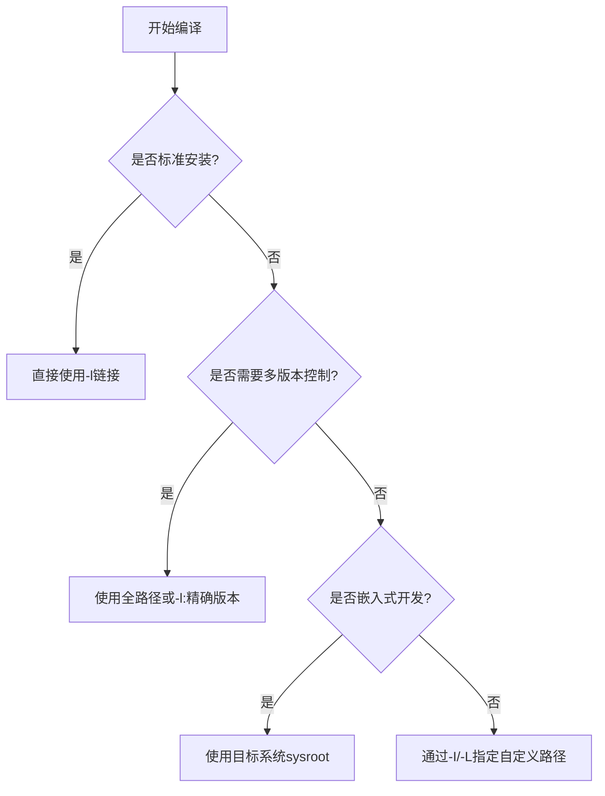

Linux（Ubuntu）系统中库文件和头文件的管理机制

---

### **一、库目录结构解析**
你列出的目录确实是Linux库文件的核心存储位置，但它们的用途有明确分工：

| 目录      | 架构位数 | 典型用途                          | 示例内容                  |
|-----------|----------|-----------------------------------|--------------------------|
| `lib`     | 32位     | 传统32位库（逐渐淘汰）            | `libc.so.6`              |
| `lib64`   | 64位     | 主流64位系统库                    | `ld-linux-x86-64.so.2`   |
| `lib32`   | 32位     | 64位系统兼容32位程序的库          | `libgcc_s.so.1`          |
| `libx32`  | x32 ABI  | 特殊x32 ABI库（较少见）           | 特定优化的库             |
| `usr/lib` | 混合     | 用户安装的软件包库                | `/usr/lib/python3.8`     |

#### **关键规则**：
1. **系统级库**：
   - `/lib`：系统启动和基本命令依赖的关键库
   - `/lib64`：64位系统的主要库（现代系统`/lib`实际是`/lib64`的符号链接）

2. **用户级库**：
   - `/usr/lib`：通过包管理器（apt/dnf）安装的库
   - `/usr/local/lib`：手动编译安装的库（优先级高于系统库）

3. **多架构共存**：
   ```bash
   # 查看Ubuntu的多架构支持情况
   dpkg --print-foreign-architectures
   # 输出示例：i386（表示支持32位）
   ```

---

### **二、头文件(include)管理机制**
头文件的存储位置更加分散，但遵循严格的规范：

#### **核心目录**：
1. **系统头文件**：
   - `/usr/include`：标准C库、系统调用等（如`stdio.h`）
   - `/usr/include/x86_64-linux-gnu`：架构相关头文件

2. **软件包头文件**：
   - `/usr/include/package_name`：如`/usr/include/python3.8`
   - `/usr/local/include`：手动安装的软件头文件

3. **内核头文件**：
   - `/usr/src/linux-headers-$(uname -r)/include`：内核开发用

#### **查找机制**：
编译器通过以下方式定位头文件：
1. **默认搜索路径**：
   ```bash
   # 查看gcc的默认头文件搜索路径
   echo | gcc -xc -E -v -
   # 输出中包含类似：
   # /usr/include
   # /usr/include/x86_64-linux-gnu
   ```

2. **自定义路径**：
   - 编译时通过`-I`参数指定：
     ```bash
     gcc -I /custom/include/path main.c
     ```

---

### **三、库与头文件的关联示例**
以安装`zlib`开发包为例：
```bash
sudo apt install zlib1g-dev
```
安装后：
- **库文件**：`/usr/lib/x86_64-linux-gnu/libz.so`
- **头文件**：`/usr/include/zlib.h`

编译时自动关联：
```bash
gcc main.c -lz  # 自动查找libz.so和zlib.h
```

---

### **四、特殊目录说明**
1. **/usr/lib vs /lib**：
   - `/lib`：系统启动必需的库（如`/lib/systemd/`）
   - `/usr/lib`：非关键库（可挂载在单独分区）

2. **/usr/local hierarchy**：
   - 手动编译安装的软件默认写入：
     - 库：`/usr/local/lib`
     - 头文件：`/usr/local/include`
   - 设计目的：与系统包管理的文件隔离

3. **运行时库查找**：
   ```bash
   # 动态链接器配置
   cat /etc/ld.so.conf
   # 通常包含：
   # /usr/local/lib
   # /usr/lib/x86_64-linux-gnu
   ```

---

### **五、问题排查技巧**
1. **查找库文件**：
   ```bash
   # 查找特定库
   ldconfig -p | grep libz
   # 输出示例：
   # libz.so.1 (libc6,x86-64) => /lib/x86_64-linux-gnu/libz.so.1
   ```

2. **检查头文件**：
   ```bash
   # 查找头文件位置
   find /usr/include -name stdio.h
   ```

3. **查看编译时的搜索路径**：
   ```bash
   gcc -print-search-dirs
   ```

---

### **六、总结图表**
```
Linux文件系统库与头文件布局
├── lib/                 # 系统关键库（32位）
│   └── systemd/
├── lib64/               # 64位主库（可能是lib的符号链接）
├── usr/
│   ├── include/         # 系统级头文件
│   │   ├── linux/       # 内核API头文件
│   │   └── x86_64-linux-gnu/  # 架构相关头文件
│   └── lib/
│       ├── x86_64-linux-gnu/  # 多架构库目录
│       └── python3.8/   # 软件包专用库
└── usr/local/           # 手动安装的软件
    ├── include/         # 自定义头文件
    └── lib/             # 自定义库
```

理解这套规范后，你就能准确预判任何Linux系统中库和头文件的位置，这对开发、调试和系统维护都至关重要。当遇到编译或链接问题时，首先检查这些目录的结构完整性是高效的排错方法。


---

### **一、编译器对标准路径的智能处理**
1. **内置的默认搜索路径**：
   - GCC和其他主流编译器在编译时**预置了完整的标准路径集合**，覆盖了：
     - 所有主流Linux发行版（Ubuntu/RHEL/Debian等）的标准目录
     - 多架构（x86/ARM等）的兼容路径
     - 系统核心和用户空间的头文件/库路径

2. **路径规范的标准化**：
   - 遵循《Linux文件系统层次标准》（FHS）
   - 示例路径（通过`gcc -v`查看）：
     ```bash
     # 头文件路径示例
     /usr/include
     /usr/include/x86_64-linux-gnu
     /usr/local/include

     # 库文件路径示例
     /usr/lib
     /usr/lib/x86_64-linux-gnu
     /usr/local/lib
     ```

3. **自动多架构适配**：
   - 当安装多架构支持时（如64位系统运行32位程序）：
     ```bash
     dpkg --add-architecture i386
     apt install libc6:i386
     ```
     编译器会自动添加`/usr/lib/i386-linux-gnu`等路径

---

### **二、为什么通常不需要手动指定路径？**
#### 1. **对系统包的透明支持**
   - 通过包管理器（apt/yum/dnf）安装的开发包会自动部署到标准位置：
     ```bash
     sudo apt install libssl-dev
     ```
     安装后：
     - 头文件放入`/usr/include/openssl`
     - 库文件放入`/usr/lib/x86_64-linux-gnu`
     - pkg-config文件（如`openssl.pc`）提供编译参数

#### 2. **工具链的智能查找顺序**
   GCC的查找策略：

   ```mermaid
   graph LR
   A[用户指定路径(-I/-L)] --> B[编译器内置路径]
   B --> C[系统标准路径]
   C --> D[多架构兼容路径]

   ```

#### 3. **环境变量的辅助**
   - `LIBRARY_PATH`：影响链接时库搜索
   - `C_INCLUDE_PATH`/`CPLUS_INCLUDE_PATH`：影响头文件搜索
   - `LD_LIBRARY_PATH`：影响运行时库搜索

---

### **三、何时仍需手动指定路径？**
虽然编译器已经非常智能，但以下情况需要显式指定：

| 场景                  | 解决方案                     | 示例命令                          |
|-----------------------|----------------------------|----------------------------------|
| 自定义安装路径的库     | `-I`/`-L`指定              | `gcc -I/opt/foo/include -L/opt/foo/lib` |
| 非标准命名的库         | 直接链接全路径              | `gcc main.c /custom/lib/libmylib.a` |
| 多个库版本共存         | 通过路径精确控制            | `-L/usr/lib/openssl-1.1 -lssl`   |
| 嵌入式开发             | 交叉编译工具链自带sysroot   | `arm-linux-gcc --sysroot=/opt/sdk` |

---

### **四、诊断工具推荐**
1. **查看完整搜索路径**：
   ```bash
   # 头文件路径
   echo | gcc -xc -E -v - 2>&1 | grep -A50 '#include <...>'

   # 库文件路径
   gcc -print-search-dirs
   ```

2. **检查编译时的实际查找过程**：
   ```bash
   # 显示头文件查找过程（DEBUG级别）
   gcc -H main.c 2>&1 | less

   # 显示链接库过程
   gcc -Wl,-verbose main.c -lz
   ```

3. **pkg-config工具**：
   ```bash
   # 查询库的编译参数
   pkg-config --cflags --libs openssl
   # 输出示例：-I/usr/include/openssl -lssl -lcrypto
   ```

---

### **五、底层原理**
1. **规范化的构建系统**：
   - 现代构建系统（CMake/Meson）会自动检测标准路径
   - 例如CMake的`find_package()`会尝试多种标准路径

2. **动态链接器协作**：
   - 编译时：`ld`使用`/etc/ld.so.conf`中的路径
   - 运行时：`ld.so`通过缓存（`ldconfig -p`）快速定位库

3. **发行版维护者的努力**：
   - Debian/Ubuntu的`multiarch`规范确保多架构兼容
   - 包管理器保证开发包（`-dev`包）部署到标准位置

---

### **六、最佳实践建议**
1. **优先使用系统包管理器**：
   ```bash
   sudo apt build-dep myproject  # 自动安装所有依赖的开发包
   ```

2. **自定义安装时保持规范**：
   ```bash
   ./configure --prefix=/usr/local  # 默认安装到标准位置
   ```

3. **调试时检查路径顺序**：
   ```bash
   strace -f -e openat gcc main.c 2>&1 | grep 'open.*\.h'
   ```

这种设计既保证了开发便利性，又通过标准化实现了跨发行版的兼容性。理解这套机制后，你会发现Linux开发环境看似复杂实则高度自洽，大部分"魔法"背后都是精心设计的规范在支撑。


---

### **1. 自定义安装路径的库**
- **自定义安装**：  
   - 优先使用系统包管理器  
   - 自定义安装时需要显式管理路径    
- **环境变量 vs 编译参数**：  
  - 临时使用：推荐用编译参数（`-I/-L`），避免污染全局环境  
  - 长期使用：建议写入配置文件（如`.bashrc`中导出`LIBRARY_PATH`/`C_INCLUDE_PATH`）  
- **标准路径优先级**：  
  ```bash
  # 推荐的自定义安装路径（按优先级排序）：
  /usr/local                # 最标准（需sudo权限）
  $HOME/.local              # 用户级（无需root）
  /opt/your_package         # 商业软件常用
  ```

---

### **2. 非标准命名的库**
- **命名**：  
   - 应优先遵循`lib<name>.so`的命名规范  

**特殊情况处理**：  
- **绝对路径链接**：  
  ```bash
  gcc main.c /path/to/libfoo.a  # 直接链接非标准库
  ```
- **符号链接技巧**：  
  ```bash
  # 为非标准库创建标准命名链接
  ln -s libfoo-1.2.so /usr/local/lib/libfoo.so
  ```

---

### **3. 多个库版本共存**
**问题**：默认使用哪个版本？  
**答案**：取决于链接器的查找顺序，但**不是简单的"最新版本"**，而是：  

1. **链接器选择规则**：  
   - 首先检查`-L`指定的路径  
   - 然后按`LIBRARY_PATH`环境变量顺序  
   - 最后搜索系统默认路径（`/usr/lib`等）  
   - **第一个找到的匹配库**会被使用  

2. **版本控制最佳实践**：  
   ```bash
   # 显式指定版本（推荐）
   gcc -l:libfoo.so.1.2  # 精确版本
   gcc -lfoo             # 默认找libfoo.so的最新主版本

   # 通过全路径避免歧义
   gcc /usr/lib/version1/libfoo.so
   ```

3. **SONAME机制**：  
   - 库文件内置了兼容性标识（通过`readelf -d libfoo.so`查看）  
   - 动态链接器会根据该标识加载匹配版本  

---

### **4. 嵌入式开发的sysroot策略**
- 推荐使用**目标系统真实的sysroot**  

**深度解释**：  
1. **为什么工具链自带的sysroot可能不够**：  
   - 工具链提供的是**通用版本**（如glibc的某个主版本）  
   - 实际设备可能有：  
     - 定制内核头文件  
     - 旧版库（如glibc 2.17 vs 工具链的2.34）  
     - 供应商修改的驱动库  

2. **如何获取真实sysroot**：  
   ```bash
   # 从目标设备提取（推荐）
   ssh root@target "tar czf - /usr/include /usr/lib /lib" > target-sysroot.tar.gz

   # 使用Buildroot/Yocto生成
   bitbake target-sysroot
   ```

3. **验证sysroot兼容性**：  
   ```bash
   # 检查glibc版本是否匹配
   arm-linux-readelf -a your_binary | grep "Shared library:"

   # 对比符号版本
   diff -u <(nm toolchain-sysroot/lib/libc.so.6) <(nm target-sysroot/lib/libc.so.6)
   ```

---

### **终极决策流程图**


---

### **强调**
1. **关于"默认使用最新版本"的误解**：  
   - Linux库版本选择**不是简单的按文件名排序**，而是依赖：  
     - 动态库的SONAME（如`libfoo.so.1`）  
     - `ldconfig`维护的缓存（`/etc/ld.so.cache`）  
     - 通过`update-alternatives`配置的默认版本  

2. **环境变量的风险提示**：  
   - 避免全局覆盖`LD_LIBRARY_PATH`，可能导致系统不稳定  
   - 更好的方式：  
     ```bash
     # 仅在编译时临时设置
     export LIBRARY_PATH=/custom/lib:$LIBRARY_PATH
     gcc main.c -lfoo
     unset LIBRARY_PATH
     ```

3. **嵌入式开发的补充建议**：  
   - 除了sysroot，还需注意：  
     - 工具链的`--target`参数（如`arm-linux-gnueabihf`）  
     - 浮点ABI设置（`-mfloat-abi=hard/softfp`）  
     - 内核头文件版本匹配（特别是驱动开发）  

